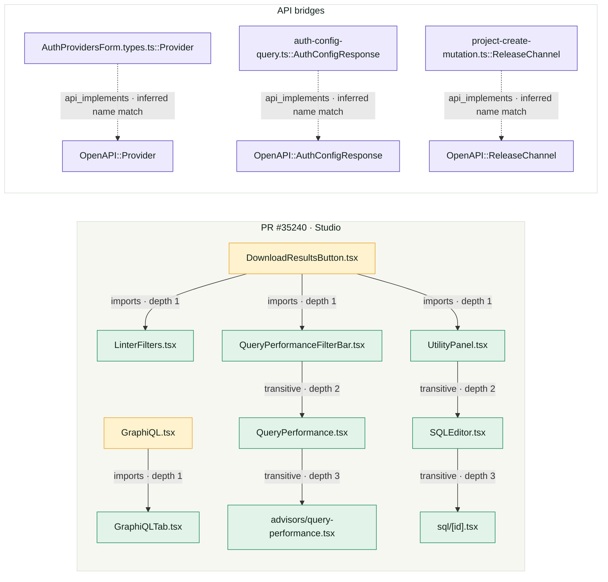

<p align="center">
  
</p>

# deep-graph

**Structural context for AI code review.**
*Currently supports TypeScript projects*

`deep-graph` answers one question: *what breaks if this file changes?* It resolves every import, type reference, and cross-module dependency through the TypeScript type system — not string matching — so the blast radius is complete, not approximate.

```bash
npx @yesprasad/deep-graph analyze
npx @yesprasad/deep-graph blast src/types/graph.ts
```

---

## Why This Exists

AI code review tools read diffs. They don't know what depends on what you changed. `deep-graph` gives them that context — a complete map of which files are affected by any change, resolved through the type system so path aliases, barrel re-exports, and cross-package imports all work correctly.

---

## Prerequisites

- **Node.js 18+**
- **A TypeScript project with a `tsconfig.json`**
- **`node_modules` installed** — needed to resolve imports into external packages
- TypeScript 4.7+ recommended (tested on 5.x)

**No other dependencies required.** `deep-graph` bundles TypeScript and uses it to load your project. It does not modify your source code, your tsconfig, or your build output.

---

## Installation

```bash
curl -fsSL https://raw.githubusercontent.com/yesprasad/deep-graph/main/install.sh | sh
```

Or via npm:

```bash
npm install -g @yesprasad/deep-graph
```

Or use directly without installing:

```bash
npx @yesprasad/deep-graph analyze
```

---

## Commands

### `analyze` — Extract the full dependency graph

```bash
deep-graph analyze
deep-graph analyze --dir /path/to/project
deep-graph analyze --output my-graph.json
deep-graph analyze --quiet --no-display
```

Produces a `deep-graph.json` file containing every module, symbol, and resolved relationship in your project.

**Output includes:**

- **Modules:** every `.ts`/`.tsx` source file with export count and line count
- **Symbols:** functions, classes, interfaces, type aliases, enums — with location, export status, and attributes
- **Import graph:** file-to-file dependencies resolved through the type system (not string-matched)
- **Heritage:** extends and implements relationships resolved through the type checker
- **Call graph:** function-to-function calls resolved through the checker, including across module boundaries and through aliased imports
- **External packages:** npm dependencies represented as typed placeholder nodes
- **Composition:** which module contains which symbols (parent-child)

### `blast` — What breaks if you change this?

```bash
deep-graph blast src/types/graph.ts
deep-graph blast loadProject
deep-graph blast CompilerState --depth 3
deep-graph blast src/extractor/modules.ts --format json
```

Runs a multi-hop reverse BFS traversal over the dependency graph. For any target (file or symbol), returns every artifact that directly or transitively depends on it, with depth tracking and risk scoring.

**Options:**

| Flag | Description | Default |
|------|-------------|---------|
| `-d, --dir <path>` | Project directory | `.` |
| `-g, --graph <path>` | Use existing graph JSON (skip extraction) | — |
| `-f, --format <type>` | Output format: `table`, `json`, `csv` | `table` |
| `--depth <n>` | Max traversal depth | `5` |

**Risk scoring:**

| Level | Threshold | Meaning |
|-------|-----------|---------|
| LOW | < 3 impacted | Safe to modify with minimal review |
| MEDIUM | 3–7 impacted | Review all direct dependents |
| HIGH | 8+ impacted | High-impact change, review the full chain |

### `blast-pr` — What breaks if you merge this PR?

```bash
deep-graph blast-pr
deep-graph blast-pr --base develop
deep-graph blast-pr --format json
deep-graph blast-pr --graph deep-graph.json --base origin/main
```

Runs blast radius on every TypeScript file changed in your current branch (relative to the base). Unions and deduplicates results across all changed files into a single impact report.

**Options:**

| Flag | Description | Default |
|------|-------------|---------|
| `-b, --base <branch>` | Base branch to diff against | `main` |
| `-d, --dir <path>` | Project directory | `.` |
| `-g, --graph <path>` | Use existing graph JSON (skip extraction) | — |
| `-f, --format <type>` | Output format: `table`, `json`, `csv` | `table` |
| `--depth <n>` | Max traversal depth | `5` |

**Risk scoring:**

| Level | Threshold | Meaning |
|-------|-----------|---------|
| LOW | < 5 impacted | Safe to merge |
| MEDIUM | 5–14 impacted | Review direct dependents |
| HIGH | 15–29 impacted | Review the full chain |
| CRITICAL | 30+ impacted | Consider splitting the PR |

---

### `pr-check` — Unified PR impact and contract analysis

```bash
deep-graph pr-check --base origin/main
deep-graph pr-check --base origin/main --format json --fail-on-breaking
deep-graph pr-check --base origin/main --openapi contracts/openapi.yaml
```

`pr-check` is the single CI entry point. It discovers changed TypeScript and OpenAPI/Swagger files, automatically finds standard contract filenames, builds the merged code/contract graph, reports semantic API changes, and traverses direct and transitive consumers. It combines the TypeScript blast radius with contract consumers in one result. Use `--openapi` for non-standard spec paths.

It exits with status `1` when `--fail-on-breaking` is set and a breaking API change is detected. The JSON output is suitable for publishing as a GitHub PR comment.

#### Example: Supabase PR impact and API graph

We ran `pr-check` against [Supabase PR #35240](https://github.com/supabase/supabase/pull/35240), a real Studio/GraphQL change that updates 31 files, including application TypeScript, React components, tests, configuration, and CI. Deep-Graph focused on the `apps/studio` TypeScript project and found direct and transitive consumers of the changed modules:

```text
Changed:  10 TypeScript/TSX files in the Studio scope
Impacted: 11 direct and transitive modules
Breaking API changes: 0
Risk: MEDIUM
```

Across the Studio code and five Supabase OpenAPI documents, Deep-Graph extracted 213 operations, 160 schemas, and 1,155 schema fields, producing a 7,788-node and 16,127-edge combined graph with 22 inferred TypeScript-to-API bridges. The diagram below is a readable excerpt of that graph—not the full graph—and shows changed modules, direct consumers, transitive consumers, and API type bridges:



Run the same analysis locally with:

```bash
deep-graph pr-check \
  --base e99725ccf59fb8dd7dd46cd3630e6a25e8c0b384 \
  --dir ./supabase/apps/studio \
  --openapi ./supabase/apps/docs/spec/analytics_v0_openapi.json \
  --openapi ./supabase/apps/docs/spec/api_v1_openapi.json \
  --openapi ./supabase/apps/docs/spec/auth_v1_openapi.json \
  --openapi ./supabase/apps/docs/spec/functions_v0_openapi.json \
  --openapi ./supabase/apps/docs/spec/storage_v0_openapi.json \
  --format json
```

The Supabase OpenAPI source used for the contract bridges is [`apps/docs/spec/api_v1_openapi.json`](https://github.com/supabase/supabase/blob/master/apps/docs/spec/api_v1_openapi.json).

---

### `api-diff` — What did we stop promising, and who was relying on it?

```bash
deep-graph api-diff --openapi openapi.json
deep-graph api-diff --openapi openapi.json --base origin/main --fail-on-breaking
deep-graph api-diff --openapi openapi.json --no-consumers --format json
```

Compares an OpenAPI document against its base revision, classifies every change as breaking or safe, and — using the merged graph — names the code that depended on what was removed.

**Options:**

| Flag | Description | Default |
|------|-------------|---------|
| `--openapi <path>` | Spec to diff (repeatable, or comma-separated) | — |
| `-b, --base <revision>` | Base revision to compare against | `main` |
| `-d, --dir <path>` | Project directory | `.` |
| `-g, --graph <path>` | Use existing graph JSON for consumer resolution | — |
| `--no-consumers` | Spec-only diff; no TypeScript project needed | — |
| `-f, --format <type>` | Output format: `table`, `json` | `table` |
| `--fail-on-breaking` | Exit `1` when a breaking change is found (for CI) | — |

Breaking-ness is judged from the consumer's side, and the direction of the field decides it:

| Change | Response field | Request field |
|--------|---------------|---------------|
| Removed | **Breaking** — readers get `undefined` | Safe — server stops requiring it |
| Added, required | Safe | **Breaking** — callers must now send it |
| Added, optional | Safe | Safe |
| `required` → optional | **Breaking** — no longer guaranteed | Safe |
| Type changed | **Breaking** | **Breaking** |

---

## OpenAPI / REST Support

Point `--openapi` at a spec and the contract becomes part of the same graph as your code. Works with **OpenAPI 3.x and Swagger 2.0**, in JSON or YAML.

```bash
deep-graph analyze --dir . --openapi openapi.json
```

**Every schema field is its own node.** This is the difference between a report that says "`LoginSuccess` changed" and one that says "`LoginSuccess.auth` was removed, and here is exactly who reads it":

```bash
deep-graph blast 'LoginSuccess.auth'
```

```text
LoginSuccess     api_schema      declares field auth              depth 1
POST /login      api_operation   returns (200)                    depth 2
GET /session     api_operation   returns (200)                    depth 2
login            function        implements endpoint [explicit]   depth 3
loadSession      function        calls endpoint [explicit]        depth 3
registerRoutes   function        implements endpoint [framework]  depth 3
```

`$ref`s stay edges rather than being inlined, so a shared schema is one node and a nested field still traces back to every operation that carries it.

### Linking code to the contract

A bridge edge is a claim that a function and an endpoint are the same thing, and those claims vary in trustworthiness. Every bridge records how it was established, strongest first — so an inferred match can be filtered out or reviewed separately.

| Confidence | Established by |
|------------|----------------|
| `explicit` | An `@openapi` annotation on the handler |
| `generated` | Metadata from an OpenAPI client generator *(reserved — not yet emitted)* |
| `framework` | A route decorator (`@Post('/login')`), direct registration, or Express chain (`router.route('/login').post(…)`) |
| `shared_type` | A TS type generated from, or shared with, the schema |
| `inferred` | Name match only — `User` in a spec is often not `User` in TypeScript |

The strongest evidence wins: once an operation has an explicit implementation, a name heuristic will not add a competing one.

**Annotations** are the reliable way to link handlers your framework hides:

```ts
/** @openapi POST /login */
export function login(email: string, password: string) { … }

/** @openapi-implements POST /login */
export function loginWithExplicitContract(email: string, password: string) { … }

/** @openapi-consumes GET /session */
export async function loadSession() { … }

/** @openapi-schema LoginSuccess */
export interface LoginResult { … }
```

### Addressing API nodes

| Form | Example |
|------|---------|
| Operation | `'POST /login'` or `api_operation:POST:/login` |
| Schema | `LoginSuccess` or `api_schema:LoginSuccess` |
| Field | `LoginSuccess.auth` or `api_property:LoginSuccess.auth` |
| Nested field | `LoginSuccess.auth.scopes` |

Prefix a target to force API resolution when a TypeScript symbol shares the name.

---

## When This Succeeds

`deep-graph` produces accurate, complete graphs when:

- The project has a valid `tsconfig.json`
- `node_modules` are installed (`npm install` has been run)
- The project compiles without fatal errors (warnings are fine — imports still resolve)
- Imports use standard TypeScript/Node.js resolution (relative paths, path aliases, barrel exports, `require()`)

The graph captures relationships that no syntax-level tool can see:

- **Path alias resolution:** `import { x } from '@/utils/helpers'` → resolved to the actual file via tsconfig `paths`
- **Barrel re-exports:** `import { Router } from './routes'` where `routes/index.ts` re-exports from three other files — `deep-graph` follows the full chain
- **Type-level dependencies:** a class that `implements` an interface from another file — the type checker resolves this even when the interface is imported through a re-export chain
- **External package identification:** every npm dependency is identified by package name, not by the `node_modules` path, and represented as a typed placeholder node
- **JavaScript files:** projects with `"allowJs": true` in tsconfig get full coverage of `.js` files — imports are resolved and types inferred the same way as `.ts` files. Mixed TS/JS codebases work out of the box

---

## When This Fails

`deep-graph` will not run or will produce incomplete results when:

- **No `tsconfig.json` exists.** deep-graph needs a project configuration to resolve imports. For pure JavaScript projects, add a `tsconfig.json` with `"allowJs": true` and `"checkJs": true`.
- **`node_modules` are not installed.** External imports can't be resolved without them. Run `npm install` first.
- **The project has fatal TypeScript errors that prevent loading.** Non-fatal type errors are fine — imports and symbols still resolve.
- **Dynamic imports with computed specifiers.** `import(variable)` where the module path is a runtime value can't be resolved statically. Only string literal specifiers are followed.
- **`require()` with non-literal arguments.** `require(config.path)` is invisible to static analysis. `require('./foo')` with a string literal is handled.
- **Monorepo packages tied together only by workspace symlinks, with no TypeScript `references`.** `analyze` follows `references` recursively when the tsconfig declares them; without them, each package's tsconfig is its own scope and needs its own `analyze` run.

---

## Limitations

### Current Version (v0.2.0)

- **OpenAPI bridges below `explicit` are heuristics.** A `framework` bridge reads a route decorator or router call statically, and will miss a prefix applied at runtime. An `inferred` bridge is a name match and nothing more. Both are labelled in every output so they can be filtered; when a link matters, add an `@openapi` annotation and it becomes `explicit`.

- **External `$ref`s are not followed.** A `$ref` pointing at another file is recorded as unresolved and reported, rather than silently dropped — those schemas are absent from the graph. Bundle the spec first (`redocly bundle`, `swagger-cli bundle`) for full coverage.

- **`api-diff` compares one revision to another, not a spec to its implementation.** It reports that the contract changed and who depended on the old shape. Whether the code actually still returns the field is a question for the reviewer, not the graph.

- **TypeScript and JavaScript (with tsconfig).** Pure `.ts` projects work out of the box. Mixed `.ts`/`.js` codebases work when the tsconfig has `"allowJs": true` — `.js` imports are resolved and types inferred the same way. Pure JavaScript projects without any tsconfig are not supported (add a `tsconfig.json` with `"allowJs": true` to enable analysis). The same approach generalizes to other languages with accessible type-system APIs (Java, C#, Rust), but those implementations don't exist yet.

- **Call graph resolves functions and methods, not dynamic dispatch.** `deep-graph` resolves calls to top-level named functions, exported arrow/function-expression consts, and class methods/constructors through `checker.getSymbolAtLocation()`, following imports and aliasing the same way "go to definition" does. What it can't resolve: calls through a callback stored in a variable, dynamic property access (`obj[key]()`), and interface/abstract method calls where the concrete implementation isn't statically determinable — the checker has no single declaration to point at for those, so no edge is emitted rather than a guessed one.

- **TypeScript project references are followed; workspace symlinks are your responsibility.** If the tsconfig `deep-graph` finds has a `references` array — the common "solution" tsconfig at a monorepo root, often with no `files`/`include` of its own — it recursively resolves every referenced project's tsconfig and unions their files into one program, so a single `analyze` at the repo root covers every referenced package. What it does *not* do is run `npm install`/`pnpm install` for you: cross-package imports by package name (`import { x } from '@myorg/core'`) only resolve once your package manager has created the `node_modules` symlinks — same requirement `tsc` itself has. A monorepo with no `references` at all (each package's tsconfig fully standalone, tied together only by workspace symlinks) needs `analyze` run once per package.

- **No incremental/watch mode.** Every `analyze` creates a fresh `ts.Program`. On large projects (1000+ files), this takes a few seconds. Incremental extraction using `ts.createIncrementalProgram` is a future optimization.

- **No visualization.** Output is JSON and CLI tables. Use external tools (D3.js, Mermaid, Graphviz) to render the graph visually.

- **External packages are opaque.** `deep-graph` identifies that your project depends on `express`, but doesn't descend into `node_modules/express` to map its internal structure. External packages are represented as placeholder nodes.

---

## Why People Need This

### 1. Pre-refactor impact analysis

You're about to rename a core interface, delete a utility file, or restructure a module. `deep-graph blast` tells you exactly what breaks — not by grepping for string matches, but by following the resolved reference chain through every import and re-export.

```bash
deep-graph blast src/types/graph.ts
# → 7 modules depend on this file, risk: MEDIUM
```

### 2. CI/CD gating

Add `deep-graph` to your pipeline to block risky merges. No plugins, no subscriptions — just a CLI command and a threshold.

#### GitHub Actions

```yaml
name: Blast Radius Gate
on: [pull_request]

jobs:
  blast-check:
    runs-on: ubuntu-latest
    steps:
      - uses: actions/checkout@v4
        with:
          fetch-depth: 0
      - uses: actions/setup-node@v4
        with:
          node-version: '20'
      - run: npm ci

      - name: PR blast radius
        run: |
          npx @yesprasad/deep-graph blast-pr --base origin/${{ github.base_ref }} --format json > blast.json
          IMPACTED=$(node -e "console.log(JSON.parse(require('fs').readFileSync('blast.json','utf8')).total_impacted)")
          RISK=$(node -e "console.log(JSON.parse(require('fs').readFileSync('blast.json','utf8')).risk_level)")
          echo "Impacted: $IMPACTED (Risk: $RISK)"
          if [ "$IMPACTED" -gt 30 ]; then
            echo "::error::PR impacts $IMPACTED artifacts — consider splitting"
            exit 1
          fi
```

#### Azure Pipelines

```yaml
- task: NodeTool@0
  inputs:
    versionSpec: '20.x'

- script: npm ci
  displayName: 'Install dependencies'

- script: |
    npx @yesprasad/deep-graph blast-pr --base origin/main --format json > blast.json
    IMPACTED=$(node -e "console.log(JSON.parse(require('fs').readFileSync('blast.json','utf8')).total_impacted)")
    echo "Impacted: $IMPACTED"
    if [ "$IMPACTED" -gt 30 ]; then
      echo "##vso[task.logissue type=error]PR impacts $IMPACTED artifacts"
      exit 1
    fi
  displayName: 'PR blast radius gate'
```

#### GitLab CI

```yaml
blast-radius:
  image: node:20
  script:
    - npm ci
    - npx @yesprasad/deep-graph blast-pr --base origin/$CI_MERGE_REQUEST_TARGET_BRANCH_NAME --format json > blast.json
    - |
      IMPACTED=$(node -e "console.log(JSON.parse(require('fs').readFileSync('blast.json','utf8')).total_impacted)")
      echo "Impacted: $IMPACTED"
      if [ "$IMPACTED" -gt 30 ]; then
        echo "PR impacts $IMPACTED artifacts — consider splitting"
        exit 1
      fi
  rules:
    - if: $CI_PIPELINE_SOURCE == "merge_request_event"
```

#### Any CI (generic)

```bash
npx @yesprasad/deep-graph blast-pr --base origin/main --format json > blast.json
IMPACTED=$(node -e "console.log(JSON.parse(require('fs').readFileSync('blast.json','utf8')).total_impacted)")
[ "$IMPACTED" -gt 30 ] && echo "CRITICAL: $IMPACTED artifacts affected" && exit 1
```

### 3. AI agent context

If you're using AI coding assistants (Claude, Cursor, Copilot), `deep-graph.json` gives the agent structural context about your project. Instead of reading every file, the agent can query the graph to understand what's connected to what — the same problem Graphify and CodeGraph solve, but with type-system-resolved accuracy instead of syntax-level parsing.

### 4. Onboarding

New engineer joins the team. Instead of reading 200 files, they run `deep-graph analyze` and see the module dependency map, which files are most imported (high centrality = high risk), and which external packages the project depends on.

### 5. Architecture documentation

`deep-graph.json` is a machine-readable architecture map. Parse it to auto-generate dependency diagrams, module relationship matrices, or impact reports for architecture reviews.

---

## Output Format

The generated `deep-graph.json` contains:

```json
{
  "metadata": {
    "projectRoot": "/path/to/project",
    "tsVersion": "5.9.3",
    "nodeCount": 35,
    "edgeCount": 44,
    "moduleCount": 8,
    "symbolCount": 22,
    "externalPackages": 5,
    "generatedAt": "2026-08-21T22:00:00.000Z"
  },
  "nodes": [
    {
      "id": "module:src/compiler/loader.ts",
      "type": "module",
      "name": "src/compiler/loader.ts",
      "attributes": {
        "exportCount": 2,
        "lineCount": 98
      },
      "source": {
        "file": "src/compiler/loader.ts"
      }
    },
    {
      "id": "symbol:src/compiler/loader.ts::loadProject",
      "type": "function",
      "name": "loadProject",
      "qualifiedName": "src/compiler/loader.ts::loadProject",
      "attributes": {
        "exported": true,
        "async": false,
        "parameterCount": 1
      },
      "source": {
        "file": "src/compiler/loader.ts",
        "line": 26,
        "column": 1
      }
    },
    {
      "id": "external:typescript",
      "type": "external_package",
      "name": "typescript",
      "attributes": {
        "isExternal": true
      },
      "source": {
        "file": "node_modules/typescript"
      }
    }
  ],
  "edges": [
    {
      "from": "module:src/extractor/modules.ts",
      "to": "module:src/compiler/loader.ts",
      "type": "import",
      "via": "../compiler/loader"
    },
    {
      "from": "module:src/compiler/loader.ts",
      "to": "symbol:src/compiler/loader.ts::loadProject",
      "type": "composition"
    }
  ]
}
```

### Node Types

| Type | Description |
|------|-------------|
| `module` | A `.ts` or `.tsx` source file |
| `function` | Function declaration or exported arrow function |
| `class` | Class declaration |
| `method` | Method or constructor declared on a class, scoped as `ClassName.methodName` |
| `interface` | Interface declaration |
| `type_alias` | Type alias declaration |
| `enum` | Enum declaration |
| `external_package` | Placeholder for npm dependency |
| `api_service` | One OpenAPI document |
| `api_operation` | One method + path pair (`POST /login`) |
| `api_schema` | A named schema |
| `api_property` | A single field on a schema (`LoginSuccess.auth`) |

### Edge Types

| Type | Description |
|------|-------------|
| `import` | Module imports from another module |
| `extends` | Class or interface extends another |
| `implements` | Class implements an interface |
| `composition` | Module contains a symbol (parent-child) |
| `type_reference` | Symbol references a type (future) |
| `call` | Function or method calls another function or method, resolved through the checker |
| `api_serves` | Service declares an operation |
| `api_request` | Operation accepts a schema as its request body |
| `api_response` | Operation returns a schema |
| `api_parameter` | Operation accepts a schema via path/query/header |
| `api_contains` | Schema declares a property (or a property nests one) |
| `api_ref` | Schema or property references another schema (`$ref`, `allOf`, …) |
| `api_implements` | TS symbol implements an operation — carries `confidence` |
| `api_consumes` | TS symbol calls an operation — carries `confidence` |

API edges point from the declaring thing to the declared thing (operation → schema → property), so reverse traversal walks a field back out to every implementation and consumer.

---

---

## MCP Server

`deep-graph` ships an MCP (Model Context Protocol) server that any AI tool can query — Claude Code, CodeRabbit, GitHub Copilot, Cursor, Windsurf, or any MCP client. The graph loads once and stays in memory for sub-100ms queries.

### Quick Setup

```bash
npx @yesprasad/deep-graph mcp-init
```

This generates the correct config for every AI tool it detects in your project. Target a specific tool with `--tool`:

```bash
deep-graph mcp-init --tool claude    # .mcp.json
deep-graph mcp-init --tool copilot   # .vscode/mcp.json
deep-graph mcp-init --tool cursor    # .cursor/mcp.json
deep-graph mcp-init --tool windsurf  # .windsurf/mcp.json
deep-graph mcp-init --tool all       # all of the above (default)
```

If deep-graph is installed locally (`devDependencies`), the config points to the local binary. Otherwise it uses `npx -y @yesprasad/deep-graph-mcp`.

### Tools Exposed

| Tool | Description |
|------|-------------|
| `blast_radius` | Impact analysis — everything that depends on a target, resolved through the type system |
| `dependencies` | Direct inbound/outbound edges for a node |
| `unused_exports` | Dead code detection — exports nothing uses |
| `graph_summary` | Project overview: node/edge counts, most-connected symbols |
| `api_contract` | OpenAPI surface — operations, schemas, and every field as an addressable node |

`blast_radius` accepts API targets too, so a reviewer can go from `api_contract` on a schema straight to the code that breaks if a field changes. When `openapi.json` / `swagger.json` (or the `.yaml` forms) sits at the project root, the server picks it up automatically — no extra configuration.

### Manual Configuration

If you prefer to configure manually, the MCP server command is:

```bash
npx @yesprasad/deep-graph-mcp
```

**Claude Code** (`.mcp.json`):
```json
{
  "mcpServers": {
    "deep-graph": {
      "command": "npx",
      "args": ["-y", "@yesprasad/deep-graph-mcp"],
      "env": {}
    }
  }
}
```

**GitHub Copilot** (`.vscode/mcp.json`):
```json
{
  "servers": {
    "deep-graph": {
      "command": "npx",
      "args": ["-y", "@yesprasad/deep-graph-mcp"],
      "env": {}
    }
  }
}
```

**CodeRabbit:** In Settings → MCP Servers → New Server, add the deep-graph MCP server. CodeRabbit will query `blast_radius` during PR reviews, giving it resolved dependency data it can't derive on its own.

The server communicates over stdio using JSON-RPC and automatically loads the TypeScript project from the current working directory (or from a `deep-graph.json` if one exists).

---

## License

MIT License

Copyright (c) 2026 Eshwar Sowbhagya Prasad Yaddanapudi.

---

## Author

**Eshwar Sowbhagya Prasad Yaddanapudi**
